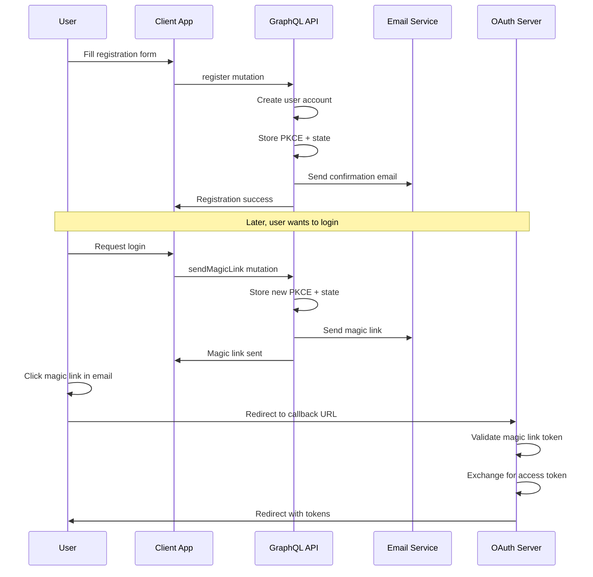
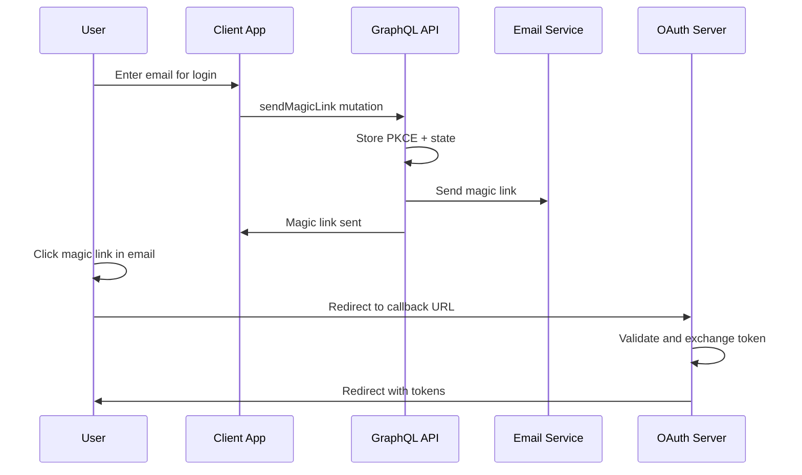
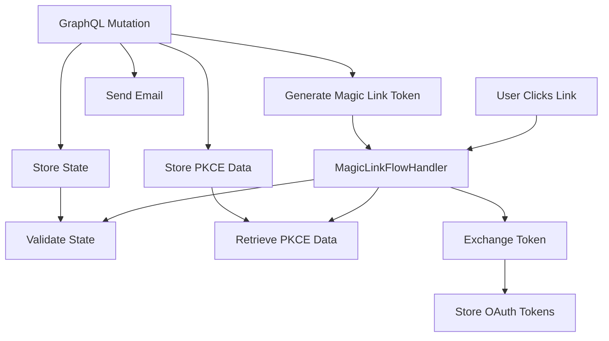

# GraphQL Integration Guide

OAuth Core now supports GraphQL mutations for user registration and sending magic links. This comprehensive guide explains how to integrate, use, and understand the complete authentication flows.

## Table of Contents

1. [Overview](#overview)
2. [Architecture](#architecture)
3. [Schema](#schema)
4. [Setup](#setup)
5. [Usage Examples](#usage-examples)
6. [Complete Flow Examples](#complete-flow-examples)
7. [Integration with OAuth Flow](#integration-with-oauth-flow)
8. [Error Handling](#error-handling)
9. [Security Considerations](#security-considerations)
10. [Testing](#testing)
11. [Framework Integration](#framework-integration)

## Overview

The GraphQL integration provides two main mutations:
- `register` - Register new users with OAuth integration
- `sendMagicLink` - Send magic links via email for authentication

These mutations work seamlessly with the existing OAuth flow handlers, creating a complete authentication system.

## Architecture

The GraphQL functionality follows a two-phase architecture:

**Phase 1: Initiation (GraphQL)**
- User registration or magic link requests
- PKCE challenge and state generation/storage
- Email sending

**Phase 2: Completion (Existing OAuth Handlers)**
- User clicks magic link → `MagicLinkFlowHandler` processes callback
- Token exchange with OAuth server
- Final authentication completion

## Schema

```graphql
scalar JSON

input RegistrationInput {
  email: String!
  additionalData: JSON!
  codeChallenge: String!
  codeChallengeMethod: String!
  redirectUri: String!
  state: String!
}

input SendMagicLinkInput {
  email: String!
  codeChallenge: String!
  codeChallengeMethod: String!
  redirectUri: String!
  state: String!
}

type RegistrationResponse {
  success: Boolean!
  message: String!
  code: String!
}

type MagicLinkResponse {
  success: Boolean!
  message: String!
  code: String!
}

type Mutation {
  register(input: RegistrationInput!): RegistrationResponse!
  sendMagicLink(input: SendMagicLinkInput!): MagicLinkResponse!
}
```

## Setup

### 1. Implement Required Adapters

You need to implement two additional adapters:

```typescript
import { UserAdapter, EmailAdapter } from '@zestic/oauth-core';

class MyUserAdapter implements UserAdapter {
  async registerUser(email: string, additionalData: Record<string, unknown>) {
    // Implement user registration logic
    // Return UserRegistrationResult
  }

  async userExists(email: string): Promise<boolean> {
    // Check if user exists
  }

  async getUserByEmail(email: string) {
    // Get user by email
  }
}

class MyEmailAdapter implements EmailAdapter {
  async sendMagicLink(email: string, magicLinkUrl: string) {
    // Send magic link email using your email service
    // Return EmailResult
  }

  async sendRegistrationConfirmation(email: string) {
    // Send registration confirmation email
    // Return EmailResult
  }
}
```

### 2. Configure GraphQL Server

```typescript
import { 
  typeDefs, 
  resolvers, 
  createGraphQLContext,
  createExampleAdapters 
} from '@zestic/oauth-core';

// Create your adapters
const adapters = {
  storage: new MyStorageAdapter(),
  http: new MyHttpAdapter(),
  pkce: new MyPKCEAdapter(),
  user: new MyUserAdapter(),
  email: new MyEmailAdapter()
};

// Configure magic link settings
const magicLinkConfig = {
  baseUrl: 'https://your-app.com/auth/callback',
  tokenEndpoint: '/oauth/token',
  expirationMinutes: 15
};

// Create GraphQL context
const context = createGraphQLContext(adapters, magicLinkConfig);

// Use with your GraphQL server (Apollo Server example)
const server = new ApolloServer({
  typeDefs,
  resolvers,
  context: () => context
});
```

## Usage Examples

### Register a New User

```graphql
mutation Register($input: RegistrationInput!) {
  register(input: $input) {
    success
    message
    code
  }
}
```

Variables:
```json
{
  "input": {
    "email": "user@example.com",
    "additionalData": {
      "firstName": "John",
      "lastName": "Doe",
      "preferences": {
        "newsletter": true
      }
    },
    "codeChallenge": "your_pkce_code_challenge",
    "codeChallengeMethod": "S256",
    "redirectUri": "https://your-app.com/auth/callback",
    "state": "your_state_value"
  }
}
```

### Send Magic Link

```graphql
mutation SendMagicLink($input: SendMagicLinkInput!) {
  sendMagicLink(input: $input) {
    success
    message
    code
  }
}
```

Variables:
```json
{
  "input": {
    "email": "user@example.com",
    "codeChallenge": "your_pkce_code_challenge",
    "codeChallengeMethod": "S256",
    "redirectUri": "https://your-app.com/auth/callback",
    "state": "your_state_value"
  }
}
```

## Complete Flow Examples

### Flow 1: Registration → Magic Link → Authentication

This is the most common flow for new users:



**Step-by-step implementation:**

1. **User Registration**
```typescript
// Generate PKCE parameters
const pkceParams = await generatePKCE();

// Register user
const registrationResult = await graphqlClient.mutate({
  mutation: REGISTER_MUTATION,
  variables: {
    input: {
      email: 'user@example.com',
      additionalData: { firstName: 'John', lastName: 'Doe' },
      codeChallenge: pkceParams.codeChallenge,
      codeChallengeMethod: 'S256',
      redirectUri: 'https://myapp.com/callback',
      state: pkceParams.state
    }
  }
});
```

2. **Request Magic Link (later)**
```typescript
// Generate new PKCE parameters for login
const loginPkceParams = await generatePKCE();

// Request magic link
const magicLinkResult = await graphqlClient.mutate({
  mutation: SEND_MAGIC_LINK_MUTATION,
  variables: {
    input: {
      email: 'user@example.com',
      codeChallenge: loginPkceParams.codeChallenge,
      codeChallengeMethod: 'S256',
      redirectUri: 'https://myapp.com/callback',
      state: loginPkceParams.state
    }
  }
});
```

3. **Handle OAuth Callback (existing flow)**
```typescript
// This uses the existing MagicLinkFlowHandler
const oauthCore = new OAuthCore(config, adapters);
const result = await oauthCore.handleCallback(callbackUrl);

if (result.success) {
  // User is now authenticated
  console.log('Access token:', result.accessToken);
}
```

### Flow 2: Direct Magic Link (No Registration)

For existing users or simplified flows:



### Flow 3: Mobile App Integration

For React Native/Expo apps using oauth-expo:

```typescript
// 1. Request magic link via GraphQL
const requestMagicLink = async (email: string) => {
  // Generate PKCE using oauth-expo
  const pkceParams = await oauthAdapter.generatePKCEParams();

  const result = await graphqlClient.mutate({
    mutation: SEND_MAGIC_LINK_MUTATION,
    variables: {
      input: {
        email,
        codeChallenge: pkceParams.codeChallenge,
        codeChallengeMethod: 'S256',
        redirectUri: 'myapp://auth/callback',
        state: pkceParams.state
      }
    }
  });

  return result;
};

// 2. Handle deep link callback (existing oauth-expo functionality)
const handleDeepLink = (url: string) => {
  // oauth-expo's existing callback handling works unchanged
  return oauthAdapter.handleCallback(url);
};
```

## Integration with OAuth Flow

The GraphQL mutations integrate seamlessly with the existing OAuth flow through shared storage and state management:

### Storage Bridge

Both GraphQL services and OAuth handlers use the same storage keys:

| Storage Key | Purpose | Set By | Used By |
|-------------|---------|--------|---------|
| `pkce_challenge` | PKCE code challenge | GraphQL services | MagicLinkFlowHandler |
| `pkce_method` | PKCE challenge method | GraphQL services | MagicLinkFlowHandler |
| `pkce_state` | OAuth state parameter | GraphQL services | StateValidator |
| `pkce_redirect_uri` | OAuth redirect URI | GraphQL services | MagicLinkFlowHandler |
| `oauth_state` | State validation | GraphQL services | StateValidator |
| `magic_link_token:*` | Magic link tokens | MagicLinkService | MagicLinkFlowHandler |

### Flow Integration Points

1. **Registration Flow**:
   - User submits registration via GraphQL
   - PKCE challenge and state are stored using OAuth-compatible keys
   - User account is created via UserAdapter
   - Registration confirmation email is sent
   - Later magic link requests can use the same user account

2. **Magic Link Flow**:
   - User requests magic link via GraphQL
   - New PKCE challenge and state are generated and stored
   - Magic link token is generated and stored with expiration
   - Magic link email is sent with callback URL
   - User clicks magic link → existing `MagicLinkFlowHandler` processes the callback
   - Handler validates state, exchanges token, and completes OAuth flow

3. **Token Exchange**:
   - MagicLinkFlowHandler retrieves stored PKCE data
   - Validates magic link token and state
   - Exchanges magic link token for OAuth access/refresh tokens
   - Stores OAuth tokens using existing TokenManager

### Data Flow Diagram



## Error Handling

The GraphQL resolvers handle errors gracefully:

```typescript
// Success response
{
  "success": true,
  "message": "User registered successfully",
  "code": "REGISTRATION_SUCCESS"
}

// Error response
{
  "success": false,
  "message": "User already exists with this email address",
  "code": "USER_EXISTS"
}
```

Common error codes:
- `USER_EXISTS` - User already registered
- `REGISTRATION_FAILED` - Registration process failed
- `EMAIL_SEND_FAILED` - Failed to send email
- `MAGIC_LINK_SENT` - Magic link sent successfully
- `INVALID_TOKEN` - Invalid or expired magic link token
- `INTERNAL_ERROR` - Unexpected server error

## Security Considerations

1. **PKCE Integration**: Both mutations properly store PKCE challenges for secure OAuth flows
2. **State Validation**: State parameters are validated to prevent CSRF attacks
3. **Email Validation**: Email addresses are validated before processing
4. **Token Expiration**: Magic link tokens have configurable expiration times
5. **Error Sanitization**: Internal errors are sanitized before returning to clients

## Testing

### Unit Tests

The GraphQL functionality includes comprehensive unit tests with 90%+ coverage:

```bash
# Run all tests
yarn test

# Run with coverage
yarn test --coverage

# Run only GraphQL tests
yarn test --testPathPattern=graphql

# Run only service tests
yarn test --testPathPattern=services
```

### Test Structure

```
tests/
├── services/
│   ├── RegistrationService.test.ts    # Registration service tests
│   └── MagicLinkService.test.ts       # Magic link service tests
├── graphql/
│   ├── resolvers.test.ts              # GraphQL resolver tests
│   └── schema.test.ts                 # Schema validation tests
└── e2e/
    └── graphql-oauth-flow.test.ts     # End-to-end flow tests
```

### Example Test Implementation

```typescript
import { resolvers, createGraphQLContext } from '@zestic/oauth-core';

describe('GraphQL Integration', () => {
  let mockAdapters: ExtendedOAuthAdapters;
  let context: GraphQLContext;

  beforeEach(() => {
    mockAdapters = createMockAdapters();
    context = createGraphQLContext(mockAdapters, magicLinkConfig);
  });

  it('should register user successfully', async () => {
    const input = {
      email: 'test@example.com',
      additionalData: { firstName: 'John' },
      codeChallenge: 'test-challenge',
      codeChallengeMethod: 'S256',
      redirectUri: 'https://app.com/callback',
      state: 'test-state'
    };

    const result = await resolvers.Mutation.register(null, { input }, context);

    expect(result.success).toBe(true);
    expect(mockAdapters.user.registerUser).toHaveBeenCalledWith(
      'test@example.com',
      { firstName: 'John' }
    );
  });
});
```

### End-to-End Testing

The end-to-end tests verify the complete flow from GraphQL mutations to OAuth callbacks:

```typescript
// Test complete registration + magic link + OAuth flow
it('should handle complete authentication flow', async () => {
  // 1. Register user via GraphQL
  const registrationResult = await resolvers.Mutation.register(/*...*/);
  expect(registrationResult.success).toBe(true);

  // 2. Request magic link via GraphQL
  const magicLinkResult = await resolvers.Mutation.sendMagicLink(/*...*/);
  expect(magicLinkResult.success).toBe(true);

  // 3. Extract magic link token from email
  const magicLinkUrl = extractMagicLinkFromEmail();
  const token = extractTokenFromUrl(magicLinkUrl);

  // 4. Simulate OAuth callback
  const callbackParams = new URLSearchParams({
    magic_link_token: token,
    state: 'test-state'
  });

  // 5. Verify OAuth flow completes successfully
  const oauthResult = await magicLinkHandler.handle(callbackParams, adapters, config);
  expect(oauthResult.success).toBe(true);
  expect(oauthResult.accessToken).toBeTruthy();
});
```

### Mock Implementations

For testing, use the provided mock adapters:

```typescript
import { createExampleAdapters } from '@zestic/oauth-core';

// Create mock adapters for testing
const adapters = createExampleAdapters();

// Override specific methods for your test scenarios
adapters.user.registerUser = jest.fn().mockResolvedValue({
  success: true,
  userId: 'test-user-id'
});

adapters.email.sendMagicLink = jest.fn().mockResolvedValue({
  success: true,
  messageId: 'test-message-id'
});
```

### Testing Best Practices

1. **Test Error Scenarios**: Verify proper error handling for invalid inputs, service failures, etc.
2. **Test State Management**: Ensure PKCE and state parameters are properly stored and validated
3. **Test Integration Points**: Verify that GraphQL services work with existing OAuth handlers
4. **Mock External Services**: Use mocks for email services, databases, and OAuth servers
5. **Test Security**: Verify input validation, state validation, and token expiration

## Framework Integration

The GraphQL schema and resolvers work with any GraphQL server implementation:

- Apollo Server
- GraphQL Yoga
- Express GraphQL
- Fastify GraphQL
- And more...

The framework-agnostic design ensures compatibility across different Node.js frameworks and deployment environments.
