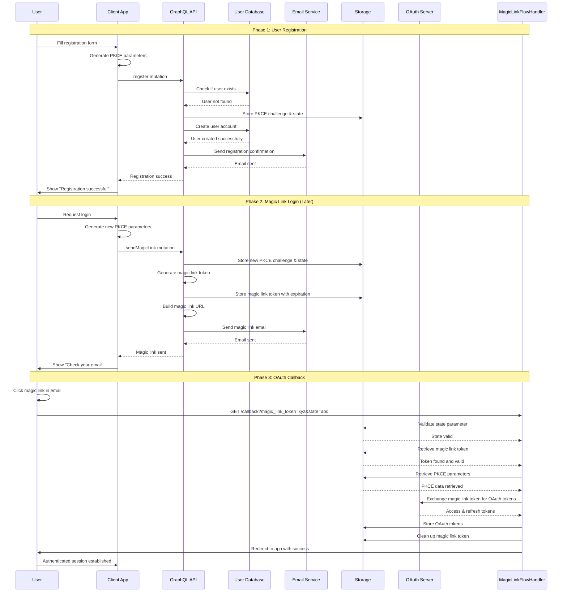
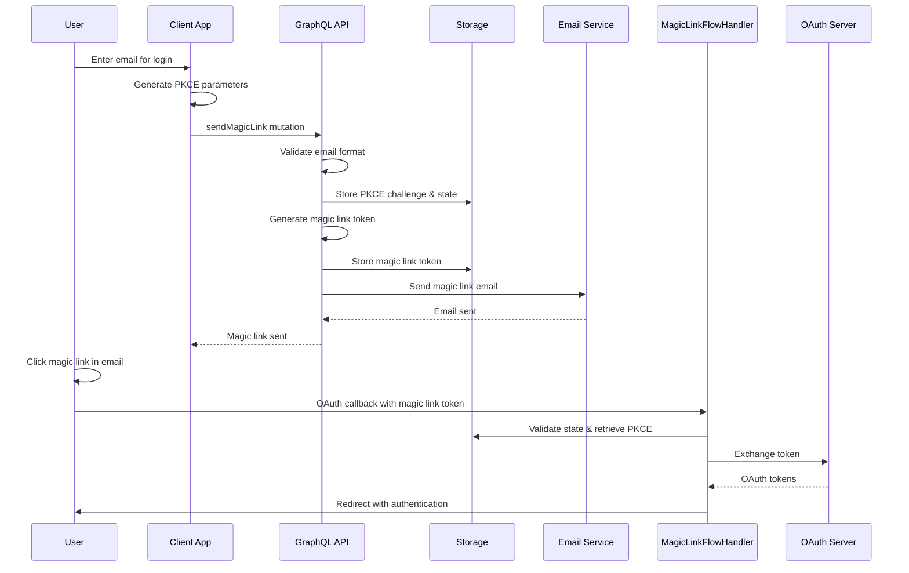
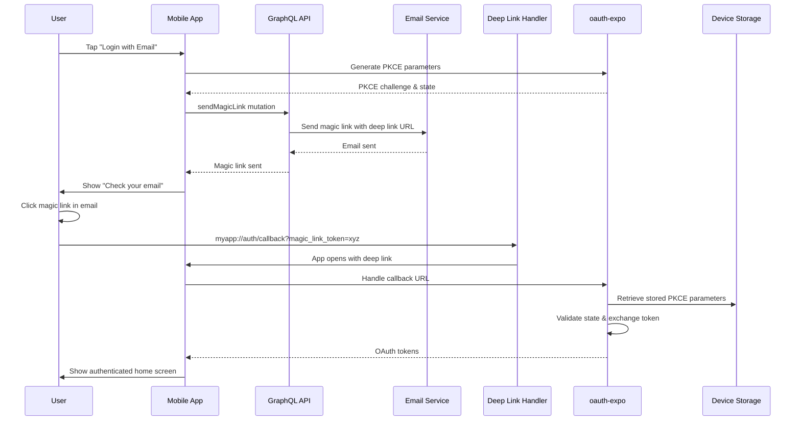
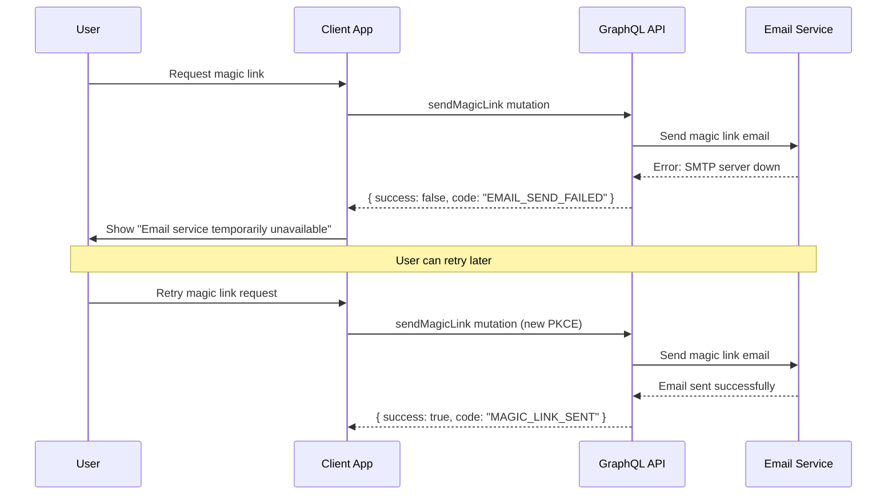
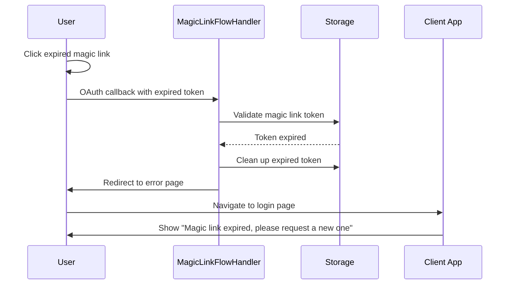
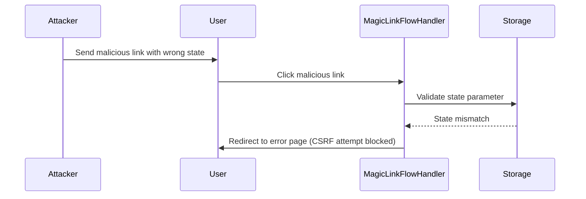
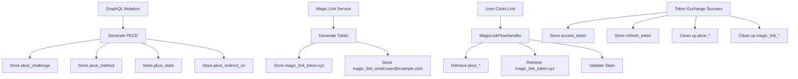

# GraphQL Authentication Flows

This document provides detailed flow diagrams and explanations for all GraphQL authentication scenarios.

## Flow Overview

The GraphQL integration supports multiple authentication flows that work seamlessly with the existing OAuth infrastructure:

1. **Registration + Magic Link Flow** - Complete user onboarding
2. **Direct Magic Link Flow** - Simplified login for existing users
3. **Mobile App Flow** - React Native/Expo integration
4. **Error Recovery Flows** - Handling failures gracefully

## Flow 1: Complete Registration + Magic Link Authentication

This is the most comprehensive flow for new users:

### Key Points:

1. **Two Separate PKCE Flows**: Registration and login use different PKCE parameters for security
2. **Shared Storage**: GraphQL services and OAuth handlers share the same storage keys
3. **Token Lifecycle**: Magic link tokens are temporary and cleaned up after use
4. **State Validation**: OAuth state parameters prevent CSRF attacks

## Flow 2: Direct Magic Link (Existing Users)

Simplified flow for users who are already registered:

### Key Points:

1. **No User Creation**: Skips user registration step
2. **Security**: Still validates email format and uses PKCE
3. **User Enumeration Protection**: Doesn't reveal whether user exists

## Flow 3: Mobile App Integration (React Native/Expo)

How GraphQL works with oauth-expo for mobile authentication:

### Key Points:

1. **Deep Links**: Magic links use custom URL schemes (myapp://)
2. **oauth-expo Integration**: Existing oauth-expo functionality handles callbacks
3. **Device Storage**: PKCE parameters stored on device securely

## Flow 4: Error Recovery Scenarios

### Scenario A: Email Service Failure

### Scenario B: Expired Magic Link Token

### Scenario C: Invalid State Parameter (CSRF Protection)

## Storage Key Lifecycle

Understanding how storage keys are managed throughout the flows:

## Security Flow Analysis

### PKCE Flow Security

1. **Code Challenge Generation**: Client generates cryptographically secure random string
2. **Challenge Storage**: Server stores challenge, client keeps verifier
3. **Token Exchange**: Server validates verifier matches stored challenge
4. **One-Time Use**: PKCE parameters are cleaned up after successful exchange

### State Parameter Security

1. **CSRF Protection**: State parameter prevents cross-site request forgery
2. **Unique Per Request**: Each magic link request generates new state
3. **Server Validation**: OAuth handler validates state matches stored value
4. **Cleanup**: State parameters are cleaned up after use

### Magic Link Token Security

1. **Cryptographically Secure**: Tokens generated using secure random functions
2. **Time-Limited**: Configurable expiration (default 15 minutes)
3. **Single Use**: Tokens are invalidated after successful exchange
4. **Scoped Storage**: Tokens stored with email association for validation

This comprehensive flow documentation ensures developers understand exactly how the GraphQL authentication system works and integrates with existing OAuth infrastructure.
